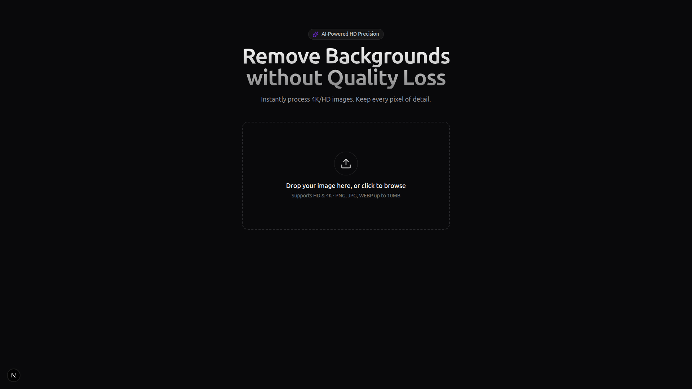

# HD Background Remover



A high-performance SaaS web application designed to remove image backgrounds while preserving **HD and 4K resolution**. Built with **Next.js 14**, **TypeScript**, and **Tailwind CSS v4**, featuring a modern, dark-themed UI with glassmorphism effects.

## ✨ Features

- **HD/4K Support**: Process high-resolution images without quality loss.
- **Drag & Drop Interface**: Intuitive upload zone with instant local preview.
- **Before/After Comparison**: Interactive slider to visually compare the original and processed images.
- **Dark Mode UI**: Premium, modern aesthetic with smooth animations.
- **Secure API Integration**: Proxied requests to Remove.bg API (or similar services) to protect API keys.
- **Responsive Design**: Fully optimized for desktop and touch devices.

## 🛠️ Tech Stack

- **Framework**: [Next.js 14](https://nextjs.org/) (App Router)
- **Language**: [TypeScript](https://www.typescriptlang.org/)
- **Styling**: [Tailwind CSS v4](https://tailwindcss.com/)
- **Animations**: [Framer Motion](https://www.framer.com/motion/)
- **Icons**: [Lucide React](https://lucide.dev/)
- **Utilities**: `clsx`, `tailwind-merge`

## 🚀 Getting Started

### Prerequisites

- Node.js 18+ installed
- npm or pnpm

### Installation

1.  **Clone the repository**:
    ```bash
    git clone https://github.com/yourusername/RemoveBG.git
    cd RemoveBG
    ```

2.  **Install dependencies**:
    ```bash
    npm install
    ```

3.  **Environment Setup**:
    Create a `.env.local` file in the root directory and add your API Key (e.g., from Remove.bg):
    ```env
    REMOVE_BG_API_KEY=your_api_key_here
    ```

4.  **Run the development server**:
    ```bash
    npm run dev
    ```

5.  Open [http://localhost:3000](http://localhost:3000) in your browser.

## 📁 Project Structure

```
├── app/
│   ├── api/          # API Routes (Proxy for external services)
│   ├── globals.css   # Global styles & Tailwind v4 Theme
│   ├── layout.tsx    # Root layout
│   └── page.tsx      # Main application page
├── components/
│   └── ui/           # Reusable UI components (Dropzone, Slider, etc.)
├── lib/              # Utility functions
└── public/           # Static assets
```

## 🎨 Customization

- **Image Size**: You can adjust the maximum width of the result container in `app/page.tsx` (currently set to `max-w-lg`).
- **Theme**: Colors and border radiuses are defined in `app/globals.css` using CSS variables and the Tailwind v4 `@theme` directive.

## 📄 License

This project is open-source and available under the [MIT License](LICENSE).
